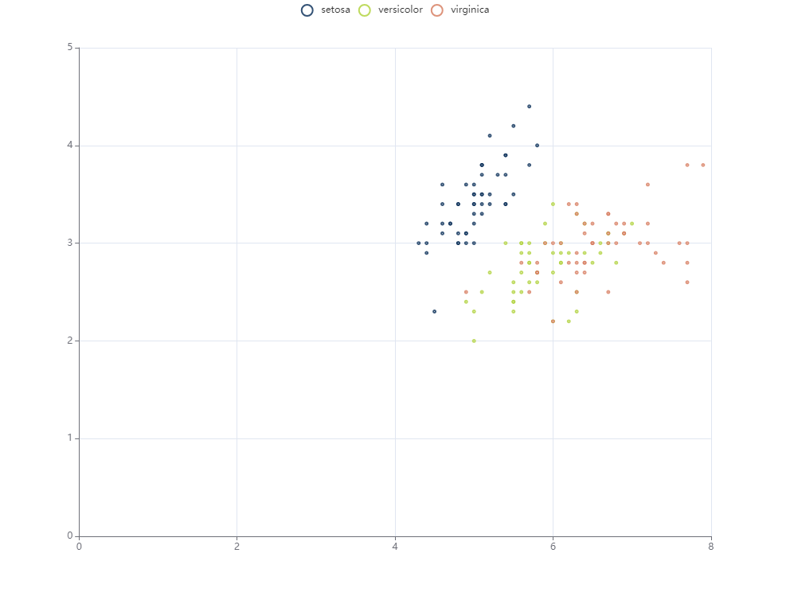
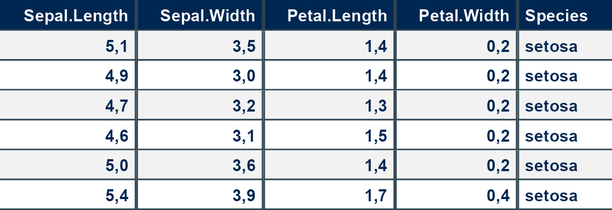
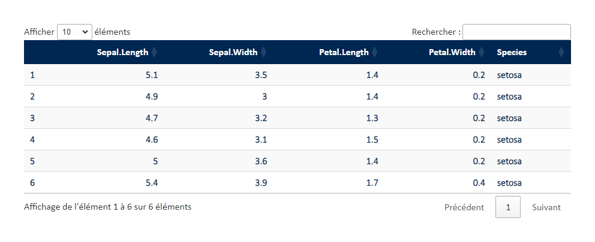

<!-- README.md is generated from README.Rmd. Please edit that file -->

# irdastyle

<!-- badges: start -->
<!-- badges: end -->

``` r
devtools::install_github("cedricbouffard/irdastyle")
```

``` r
library(irdastyle)
```

## ggplot2

``` r
library(ggplot2)
ggplot(data = iris, aes(x = Sepal.Length, y = Sepal.Width, color = Species)) +
  geom_point() +
  theme_irda() +
  scale_color_irda()
```


## echarts

``` r
library(echarts4r)
a=iris|>
 dplyr::group_by(Species) |>
   e_charts(Sepal.Length) |>
   e_scatter(Sepal.Width) |>
   e_theme_irda()
```



## gt

``` r
library(gt)
gt(iris |> head() ) |>
  theme_gt_irda()
```

<div id="cgmcnogmzb" style="padding-left:0px;padding-right:0px;padding-top:10px;padding-bottom:10px;overflow-x:auto;overflow-y:auto;width:auto;height:auto;">
<style>#cgmcnogmzb table {
  font-family: 'Calibri Light';
  -webkit-font-smoothing: antialiased;
  -moz-osx-font-smoothing: grayscale;
}
&#10;#cgmcnogmzb thead, #cgmcnogmzb tbody, #cgmcnogmzb tfoot, #cgmcnogmzb tr, #cgmcnogmzb td, #cgmcnogmzb th {
  border-style: none;
}
&#10;#cgmcnogmzb p {
  margin: 0;
  padding: 0;
}
&#10;#cgmcnogmzb .gt_table {
  display: table;
  border-collapse: collapse;
  line-height: normal;
  margin-left: auto;
  margin-right: auto;
  color: #333333;
  font-size: 16px;
  font-weight: bold;
  font-style: normal;
  background-color: #FFFFFF;
  width: auto;
  border-top-style: solid;
  border-top-width: 2px;
  border-top-color: #A8A8A8;
  border-right-style: none;
  border-right-width: 2px;
  border-right-color: #D3D3D3;
  border-bottom-style: solid;
  border-bottom-width: 2px;
  border-bottom-color: #A8A8A8;
  border-left-style: none;
  border-left-width: 2px;
  border-left-color: #D3D3D3;
}
&#10;#cgmcnogmzb .gt_caption {
  padding-top: 4px;
  padding-bottom: 4px;
}
&#10;#cgmcnogmzb .gt_title {
  color: #333333;
  font-size: 125%;
  font-weight: initial;
  padding-top: 4px;
  padding-bottom: 4px;
  padding-left: 5px;
  padding-right: 5px;
  border-bottom-color: #FFFFFF;
  border-bottom-width: 0;
}
&#10;#cgmcnogmzb .gt_subtitle {
  color: #333333;
  font-size: 85%;
  font-weight: initial;
  padding-top: 3px;
  padding-bottom: 5px;
  padding-left: 5px;
  padding-right: 5px;
  border-top-color: #FFFFFF;
  border-top-width: 0;
}
&#10;#cgmcnogmzb .gt_heading {
  background-color: #FFFFFF;
  text-align: center;
  border-bottom-color: #FFFFFF;
  border-left-style: none;
  border-left-width: 1px;
  border-left-color: #D3D3D3;
  border-right-style: none;
  border-right-width: 1px;
  border-right-color: #D3D3D3;
}
&#10;#cgmcnogmzb .gt_bottom_border {
  border-bottom-style: solid;
  border-bottom-width: 2px;
  border-bottom-color: #D3D3D3;
}
&#10;#cgmcnogmzb .gt_col_headings {
  border-top-style: solid;
  border-top-width: 2px;
  border-top-color: #D3D3D3;
  border-bottom-style: solid;
  border-bottom-width: 2px;
  border-bottom-color: #D3D3D3;
  border-left-style: none;
  border-left-width: 1px;
  border-left-color: #D3D3D3;
  border-right-style: none;
  border-right-width: 1px;
  border-right-color: #D3D3D3;
}
&#10;#cgmcnogmzb .gt_col_heading {
  color: #FFFFFF;
  background-color: #002752;
  font-size: 16px;
  font-weight: bold;
  text-transform: inherit;
  border-left-style: none;
  border-left-width: 1px;
  border-left-color: #D3D3D3;
  border-right-style: none;
  border-right-width: 1px;
  border-right-color: #D3D3D3;
  vertical-align: bottom;
  padding-top: 5px;
  padding-bottom: 6px;
  padding-left: 5px;
  padding-right: 5px;
  overflow-x: hidden;
}
&#10;#cgmcnogmzb .gt_column_spanner_outer {
  color: #FFFFFF;
  background-color: #002752;
  font-size: 16px;
  font-weight: bold;
  text-transform: inherit;
  padding-top: 0;
  padding-bottom: 0;
  padding-left: 4px;
  padding-right: 4px;
}
&#10;#cgmcnogmzb .gt_column_spanner_outer:first-child {
  padding-left: 0;
}
&#10;#cgmcnogmzb .gt_column_spanner_outer:last-child {
  padding-right: 0;
}
&#10;#cgmcnogmzb .gt_column_spanner {
  border-bottom-style: solid;
  border-bottom-width: 2px;
  border-bottom-color: #D3D3D3;
  vertical-align: bottom;
  padding-top: 5px;
  padding-bottom: 5px;
  overflow-x: hidden;
  display: inline-block;
  width: 100%;
}
&#10;#cgmcnogmzb .gt_spanner_row {
  border-bottom-style: hidden;
}
&#10;#cgmcnogmzb .gt_group_heading {
  padding-top: 8px;
  padding-bottom: 8px;
  padding-left: 5px;
  padding-right: 5px;
  color: #FFFFFF;
  background-color: #AED136;
  font-size: 22px;
  font-weight: bold;
  text-transform: inherit;
  border-top-style: solid;
  border-top-width: 2px;
  border-top-color: #D3D3D3;
  border-bottom-style: solid;
  border-bottom-width: 2px;
  border-bottom-color: #D3D3D3;
  border-left-style: none;
  border-left-width: 1px;
  border-left-color: #D3D3D3;
  border-right-style: none;
  border-right-width: 1px;
  border-right-color: #D3D3D3;
  vertical-align: middle;
  text-align: left;
}
&#10;#cgmcnogmzb .gt_empty_group_heading {
  padding: 0.5px;
  color: #FFFFFF;
  background-color: #AED136;
  font-size: 22px;
  font-weight: bold;
  border-top-style: solid;
  border-top-width: 2px;
  border-top-color: #D3D3D3;
  border-bottom-style: solid;
  border-bottom-width: 2px;
  border-bottom-color: #D3D3D3;
  vertical-align: middle;
}
&#10;#cgmcnogmzb .gt_from_md > :first-child {
  margin-top: 0;
}
&#10;#cgmcnogmzb .gt_from_md > :last-child {
  margin-bottom: 0;
}
&#10;#cgmcnogmzb .gt_row {
  padding-top: 8px;
  padding-bottom: 8px;
  padding-left: 5px;
  padding-right: 5px;
  margin: 10px;
  border-top-style: solid;
  border-top-width: 1px;
  border-top-color: #D3D3D3;
  border-left-style: none;
  border-left-width: 1px;
  border-left-color: #D3D3D3;
  border-right-style: none;
  border-right-width: 1px;
  border-right-color: #D3D3D3;
  vertical-align: middle;
  overflow-x: hidden;
}
&#10;#cgmcnogmzb .gt_stub {
  color: #333333;
  background-color: #FFFFFF;
  font-size: 100%;
  font-weight: initial;
  text-transform: inherit;
  border-right-style: solid;
  border-right-width: 2px;
  border-right-color: #D3D3D3;
  padding-left: 5px;
  padding-right: 5px;
}
&#10;#cgmcnogmzb .gt_stub_row_group {
  color: #333333;
  background-color: #FFFFFF;
  font-size: 100%;
  font-weight: initial;
  text-transform: inherit;
  border-right-style: solid;
  border-right-width: 2px;
  border-right-color: #D3D3D3;
  padding-left: 5px;
  padding-right: 5px;
  vertical-align: top;
}
&#10;#cgmcnogmzb .gt_row_group_first td {
  border-top-width: 2px;
}
&#10;#cgmcnogmzb .gt_row_group_first th {
  border-top-width: 2px;
}
&#10;#cgmcnogmzb .gt_summary_row {
  color: #333333;
  background-color: #FFFFFF;
  text-transform: inherit;
  padding-top: 8px;
  padding-bottom: 8px;
  padding-left: 5px;
  padding-right: 5px;
}
&#10;#cgmcnogmzb .gt_first_summary_row {
  border-top-style: solid;
  border-top-color: #D3D3D3;
}
&#10;#cgmcnogmzb .gt_first_summary_row.thick {
  border-top-width: 2px;
}
&#10;#cgmcnogmzb .gt_last_summary_row {
  padding-top: 8px;
  padding-bottom: 8px;
  padding-left: 5px;
  padding-right: 5px;
  border-bottom-style: solid;
  border-bottom-width: 2px;
  border-bottom-color: #D3D3D3;
}
&#10;#cgmcnogmzb .gt_grand_summary_row {
  color: #333333;
  background-color: #FFFFFF;
  text-transform: inherit;
  padding-top: 8px;
  padding-bottom: 8px;
  padding-left: 5px;
  padding-right: 5px;
}
&#10;#cgmcnogmzb .gt_first_grand_summary_row {
  padding-top: 8px;
  padding-bottom: 8px;
  padding-left: 5px;
  padding-right: 5px;
  border-top-style: double;
  border-top-width: 6px;
  border-top-color: #D3D3D3;
}
&#10;#cgmcnogmzb .gt_last_grand_summary_row_top {
  padding-top: 8px;
  padding-bottom: 8px;
  padding-left: 5px;
  padding-right: 5px;
  border-bottom-style: double;
  border-bottom-width: 6px;
  border-bottom-color: #D3D3D3;
}
&#10;#cgmcnogmzb .gt_striped {
  background-color: #F2F2F2;
}
&#10;#cgmcnogmzb .gt_table_body {
  border-top-style: solid;
  border-top-width: 2px;
  border-top-color: #D3D3D3;
  border-bottom-style: solid;
  border-bottom-width: 2px;
  border-bottom-color: #D3D3D3;
}
&#10;#cgmcnogmzb .gt_footnotes {
  color: #333333;
  background-color: #FFFFFF;
  border-bottom-style: none;
  border-bottom-width: 2px;
  border-bottom-color: #D3D3D3;
  border-left-style: none;
  border-left-width: 2px;
  border-left-color: #D3D3D3;
  border-right-style: none;
  border-right-width: 2px;
  border-right-color: #D3D3D3;
}
&#10;#cgmcnogmzb .gt_footnote {
  margin: 0px;
  font-size: 90%;
  padding-top: 4px;
  padding-bottom: 4px;
  padding-left: 5px;
  padding-right: 5px;
}
&#10;#cgmcnogmzb .gt_sourcenotes {
  color: #333333;
  background-color: #FFFFFF;
  border-bottom-style: none;
  border-bottom-width: 2px;
  border-bottom-color: #D3D3D3;
  border-left-style: none;
  border-left-width: 2px;
  border-left-color: #D3D3D3;
  border-right-style: none;
  border-right-width: 2px;
  border-right-color: #D3D3D3;
}
&#10;#cgmcnogmzb .gt_sourcenote {
  font-size: 90%;
  padding-top: 4px;
  padding-bottom: 4px;
  padding-left: 5px;
  padding-right: 5px;
}
&#10;#cgmcnogmzb .gt_left {
  text-align: left;
}
&#10;#cgmcnogmzb .gt_center {
  text-align: center;
}
&#10;#cgmcnogmzb .gt_right {
  text-align: right;
  font-variant-numeric: tabular-nums;
}
&#10;#cgmcnogmzb .gt_font_normal {
  font-weight: normal;
}
&#10;#cgmcnogmzb .gt_font_bold {
  font-weight: bold;
}
&#10;#cgmcnogmzb .gt_font_italic {
  font-style: italic;
}
&#10;#cgmcnogmzb .gt_super {
  font-size: 65%;
}
&#10;#cgmcnogmzb .gt_footnote_marks {
  font-size: 75%;
  vertical-align: 0.4em;
  position: initial;
}
&#10;#cgmcnogmzb .gt_asterisk {
  font-size: 100%;
  vertical-align: 0;
}
&#10;#cgmcnogmzb .gt_indent_1 {
  text-indent: 5px;
}
&#10;#cgmcnogmzb .gt_indent_2 {
  text-indent: 10px;
}
&#10;#cgmcnogmzb .gt_indent_3 {
  text-indent: 15px;
}
&#10;#cgmcnogmzb .gt_indent_4 {
  text-indent: 20px;
}
&#10;#cgmcnogmzb .gt_indent_5 {
  text-indent: 25px;
}
</style>
<table class="gt_table" data-quarto-disable-processing="false" data-quarto-bootstrap="false">
  <thead>
    <tr class="gt_col_headings">
      <th class="gt_col_heading gt_columns_bottom_border gt_right" rowspan="1" colspan="1" scope="col" id="Sepal.Length">Sepal.Length</th>
      <th class="gt_col_heading gt_columns_bottom_border gt_right" rowspan="1" colspan="1" scope="col" id="Sepal.Width">Sepal.Width</th>
      <th class="gt_col_heading gt_columns_bottom_border gt_right" rowspan="1" colspan="1" scope="col" id="Petal.Length">Petal.Length</th>
      <th class="gt_col_heading gt_columns_bottom_border gt_right" rowspan="1" colspan="1" scope="col" id="Petal.Width">Petal.Width</th>
      <th class="gt_col_heading gt_columns_bottom_border gt_center" rowspan="1" colspan="1" scope="col" id="Species">Species</th>
    </tr>
  </thead>
  <tbody class="gt_table_body">
    <tr><td headers="Sepal.Length" class="gt_row gt_right">5.1</td>
<td headers="Sepal.Width" class="gt_row gt_right">3.5</td>
<td headers="Petal.Length" class="gt_row gt_right">1.4</td>
<td headers="Petal.Width" class="gt_row gt_right">0.2</td>
<td headers="Species" class="gt_row gt_center">setosa</td></tr>
    <tr><td headers="Sepal.Length" class="gt_row gt_right gt_striped">4.9</td>
<td headers="Sepal.Width" class="gt_row gt_right gt_striped">3.0</td>
<td headers="Petal.Length" class="gt_row gt_right gt_striped">1.4</td>
<td headers="Petal.Width" class="gt_row gt_right gt_striped">0.2</td>
<td headers="Species" class="gt_row gt_center gt_striped">setosa</td></tr>
    <tr><td headers="Sepal.Length" class="gt_row gt_right">4.7</td>
<td headers="Sepal.Width" class="gt_row gt_right">3.2</td>
<td headers="Petal.Length" class="gt_row gt_right">1.3</td>
<td headers="Petal.Width" class="gt_row gt_right">0.2</td>
<td headers="Species" class="gt_row gt_center">setosa</td></tr>
    <tr><td headers="Sepal.Length" class="gt_row gt_right gt_striped">4.6</td>
<td headers="Sepal.Width" class="gt_row gt_right gt_striped">3.1</td>
<td headers="Petal.Length" class="gt_row gt_right gt_striped">1.5</td>
<td headers="Petal.Width" class="gt_row gt_right gt_striped">0.2</td>
<td headers="Species" class="gt_row gt_center gt_striped">setosa</td></tr>
    <tr><td headers="Sepal.Length" class="gt_row gt_right">5.0</td>
<td headers="Sepal.Width" class="gt_row gt_right">3.6</td>
<td headers="Petal.Length" class="gt_row gt_right">1.4</td>
<td headers="Petal.Width" class="gt_row gt_right">0.2</td>
<td headers="Species" class="gt_row gt_center">setosa</td></tr>
    <tr><td headers="Sepal.Length" class="gt_row gt_right gt_striped">5.4</td>
<td headers="Sepal.Width" class="gt_row gt_right gt_striped">3.9</td>
<td headers="Petal.Length" class="gt_row gt_right gt_striped">1.7</td>
<td headers="Petal.Width" class="gt_row gt_right gt_striped">0.4</td>
<td headers="Species" class="gt_row gt_center gt_striped">setosa</td></tr>
  </tbody>
  &#10;  
</table>
</div>

## flextable

``` r
library(flextable)
flextable(iris|>head()) |>
 flextable_irda()
```



## DT

``` r

datatable_irda(iris|>head())
```


