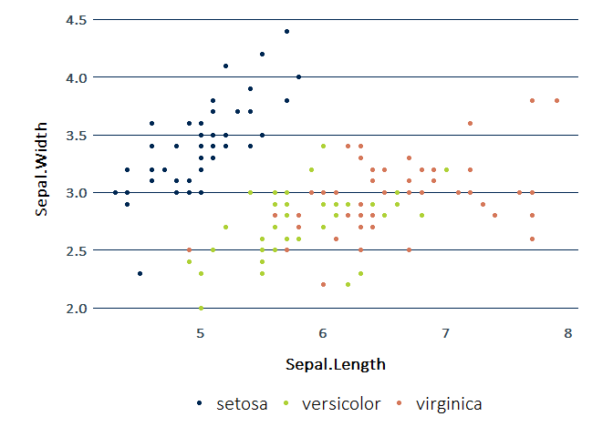

<!-- README.md is generated from README.Rmd. Please edit that file -->

# irdastyle

<!-- badges: start -->
<!-- badges: end -->

``` r
devtools::install_github("cedricbouffard/irdastyle")
```

``` r
library(irdastyle)
```

## ggplot2

``` r
library(ggplot2)
ggplot(data = iris, aes(x = Sepal.Length, y = Sepal.Width, color = Species)) +
  geom_point() +
  theme_irda() +
  scale_color_irda()
```



## echarts

``` r
library(echarts4r)
a=iris|>
 dplyr::group_by(Species) |>
   e_charts(Sepal.Length) |>
   e_scatter(Sepal.Width) |>
   e_theme_irda()
```


## gt

``` r
library(gt)
gt(iris |> head() ) |>
  theme_gt_irda() 
```


## flextable

``` r
library(flextable)
flextable(iris|>head()) |>
 flextable_irda()
```


## DT

``` r

datatable_irda(iris|>head())
```


